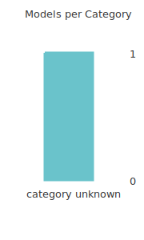

# Evaluation from 2024-07-29 13:13:21

This report was generated by [DevQualityEval benchmark](https://github.com/symflower/eval-dev-quality) in `version 0.5.0` - `revision `.

## Results

> Keep in mind that LLMs are nondeterministic. The following results just reflect a current snapshot.

The results of all models have been divided into the following categories:
- category unknown: Models in this category could not be categorized.
- response error: Models in this category encountered an error.
- no code: Models in this category produced no code.
- invalid code: Models in this category produced invalid code.
- executable code: Models in this category produced executable code.
- statement coverage reached: Models in this category produced code that reached full statement coverage.
- no excess response: Models in this category did not respond with more content than requested.

The following sections list all models with their categories. Detailed scoring can be found [here](./evaluation.csv). The complete log of the evaluation with all outputs can be found here:
- ./evaluation.log

### Result category "category unknown"

Models in this category could not be categorized.

- [`ollama/granite-code:8b-instruct-q8_0`](./ollama_granite-code_8b-instruct-q8_0/)

