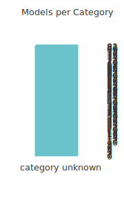

# Evaluation from 0001-01-01 00:00:00

This report was generated by [DevQualityEval benchmark](https://github.com/symflower/eval-dev-quality) in `version 0.5.0` - `revision 06920b6`.

## Results

> Keep in mind that LLMs are nondeterministic. The following results just reflect a current snapshot.

The results of all models have been divided into the following categories:
- category unknown: Models in this category could not be categorized.
- response error: Models in this category encountered an error.
- no code: Models in this category produced no code.
- invalid code: Models in this category produced invalid code.
- executable code: Models in this category produced executable code.
- statement coverage reached: Models in this category produced code that reached full statement coverage.
- no excess response: Models in this category did not respond with more content than requested.

The following sections list all models with their categories. Detailed scoring can be found [here](./evaluation.csv). The complete log of the evaluation with all outputs can be found here:
- openrouter_alpindale_magnum-72b/evaluation.log
- openrouter_anthropic_claude-3.5-sonnet/evaluation.log
- openrouter_google_gemma-2-9b-it/evaluation.log
- openrouter_microsoft_wizardlm-2-7b/evaluation.log
- openrouter_mistralai_mistral-medium/evaluation.log
- openrouter_openai_gpt-4-turbo/evaluation.log
- openrouter_google_gemma-2-27b-it/evaluation.log
- openrouter_google_palm-2-chat-bison/evaluation.log
- openrouter_meta-llama_llama-3.1-70b-instruct/evaluation.log
- openrouter_mistralai_mistral-tiny/evaluation.log
- openrouter_nousresearch_nous-capybara-7b/evaluation.log
- openrouter_recursal_eagle-7b/evaluation.log
- openrouter_teknium_openhermes-2-mistral-7b/evaluation.log
- openrouter_qwen_qwen-2-72b-instruct/evaluation.log
- openrouter_01-ai_yi-34b-chat/evaluation.log
- openrouter_ai21_jamba-instruct/evaluation.log
- openrouter_anthropic_claude-3-sonnet/evaluation.log
- openrouter_microsoft_phi-3-mini-128k-instruct/evaluation.log
- openrouter_nousresearch_nous-hermes-2-mixtral-8x7b-dpo/evaluation.log
- openrouter_openai_gpt-4o-mini/evaluation.log
- openrouter_qwen_qwen-110b-chat/evaluation.log
- openrouter_qwen_qwen-4b-chat/evaluation.log
- openrouter_togethercomputer_stripedhyena-nous-7b/evaluation.log
- openrouter_meta-llama_llama-3-8b-instruct/evaluation.log
- openrouter_nousresearch_nous-hermes-2-mistral-7b-dpo/evaluation.log
- openrouter_perplexity_llama-3-sonar-small-32k-chat/evaluation.log
- openrouter_microsoft_phi-3-medium-128k-instruct/evaluation.log
- openrouter_mistralai_codestral-mamba/evaluation.log
- openrouter_rwkv_rwkv-5-world-3b/evaluation.log
- openrouter_allenai_olmo-7b-instruct/evaluation.log
- openrouter_cognitivecomputations_dolphin-mixtral-8x22b/evaluation.log
- openrouter_meta-llama_llama-3.1-405b-instruct/evaluation.log
- openrouter_meta-llama_llama-3-70b-instruct/evaluation.log
- openrouter_perplexity_llama-3-sonar-large-32k-chat/evaluation.log
- openrouter_qwen_qwen-2-7b-instruct/evaluation.log
- openrouter_qwen_qwen-7b-chat/evaluation.log
- openrouter_cohere_command-r-plus/evaluation.log
- openrouter_deepseek_deepseek-chat/evaluation.log
- openrouter_google_gemma-7b-it/evaluation.log
- openrouter_meta-llama_codellama-70b-instruct/evaluation.log
- openrouter_neversleep_llama-3-lumimaid-8b/evaluation.log
- openrouter_togethercomputer_stripedhyena-hessian-7b/evaluation.log
- openrouter_databricks_dbrx-instruct/evaluation.log
- openrouter_meta-llama_codellama-34b-instruct/evaluation.log
- openrouter_mistralai_mistral-large/evaluation.log
- openrouter_xwin-lm_xwin-lm-70b/evaluation.log
- openrouter_deepseek_deepseek-coder/evaluation.log
- openrouter_microsoft_phi-3-medium-4k-instruct/evaluation.log
- openrouter_neversleep_llama-3-lumimaid-70b/evaluation.log
- openrouter_nousresearch_hermes-2-pro-llama-3-8b/evaluation.log
- openrouter_qwen_qwen-72b-chat/evaluation.log
- openrouter_cognitivecomputations_dolphin-mixtral-8x7b/evaluation.log
- openrouter_fireworks_firellava-13b/evaluation.log
- openrouter_google_palm-2-codechat-bison/evaluation.log
- openrouter_recursal_rwkv-5-3b-ai-town/evaluation.log
- openrouter_alpindale_goliath-120b/evaluation.log
- openrouter_austism_chronos-hermes-13b/evaluation.log
- openrouter_snowflake_snowflake-arctic-instruct/evaluation.log
- openrouter_01-ai_yi-large/evaluation.log
- openrouter_google_gemini-flash-1.5/evaluation.log
- openrouter_microsoft_wizardlm-2-8x22b/evaluation.log
- openrouter_mistralai_mistral-7b-instruct-v0.3/evaluation.log
- openrouter_nousresearch_nous-hermes-2-mixtral-8x7b-sft/evaluation.log
- openrouter_openchat_openchat-8b/evaluation.log
- openrouter_phind_phind-codellama-34b/evaluation.log
- openrouter_anthropic_claude-3-haiku/evaluation.log
- openrouter_meta-llama_llama-3.1-8b-instruct/evaluation.log
- openrouter_mistralai_mixtral-8x22b-instruct/evaluation.log
- openrouter_mistralai_mixtral-8x7b-instruct/evaluation.log
- openrouter_qwen_qwen-32b-chat/evaluation.log
- openrouter_undi95_toppy-m-7b/evaluation.log
- openrouter_mistralai_mistral-nemo/evaluation.log
- openrouter_openai_gpt-4o/evaluation.log
- openrouter_open-orca_mistral-7b-openorca/evaluation.log
- openrouter_qwen_qwen-14b-chat/evaluation.log
- openrouter_google_gemini-pro-1.5/evaluation.log
- openrouter_mistralai_mistral-small/evaluation.log
- openrouter_nousresearch_nous-hermes-yi-34b/evaluation.log
- openrouter_01-ai_yi-6b/evaluation.log
- openrouter_cognitivecomputations_dolphin-llama-3-70b/evaluation.log
- openrouter_nousresearch_hermes-2-theta-llama-3-8b/evaluation.log
- openrouter_teknium_openhermes-2.5-mistral-7b/evaluation.log

### Result category "category unknown"

Models in this category could not be categorized.

- [`openrouter/mistralai/mixtral-8x7b-instruct`](./openrouter_mistralai_mixtral-8x7b-instruct/)
- [`openrouter/openai/gpt-4-turbo`](./openrouter_openai_gpt-4-turbo/)
- [`openrouter/openai/gpt-4o-mini`](./openrouter_openai_gpt-4o-mini/)
- [`openrouter/01-ai/yi-34b-chat`](./openrouter_01-ai_yi-34b-chat/)
- [`openrouter/anthropic/claude-3.5-sonnet`](./openrouter_anthropic_claude-3.5-sonnet/)
- [`openrouter/fireworks/firellava-13b`](./openrouter_fireworks_firellava-13b/)
- [`openrouter/google/gemini-pro-1.5`](./openrouter_google_gemini-pro-1.5/)
- [`openrouter/google/gemma-2-9b-it`](./openrouter_google_gemma-2-9b-it/)
- [`openrouter/teknium/openhermes-2-mistral-7b`](./openrouter_teknium_openhermes-2-mistral-7b/)
- [`openrouter/openchat/openchat-8b`](./openrouter_openchat_openchat-8b/)
- [`openrouter/perplexity/llama-3-sonar-small-32k-chat`](./openrouter_perplexity_llama-3-sonar-small-32k-chat/)
- [`openrouter/undi95/toppy-m-7b`](./openrouter_undi95_toppy-m-7b/)
- [`openrouter/austism/chronos-hermes-13b`](./openrouter_austism_chronos-hermes-13b/)
- [`openrouter/google/gemma-7b-it`](./openrouter_google_gemma-7b-it/)
- [`openrouter/meta-llama/codellama-34b-instruct`](./openrouter_meta-llama_codellama-34b-instruct/)
- [`openrouter/microsoft/phi-3-medium-4k-instruct`](./openrouter_microsoft_phi-3-medium-4k-instruct/)
- [`openrouter/mistralai/mistral-medium`](./openrouter_mistralai_mistral-medium/)
- [`openrouter/deepseek/deepseek-coder`](./openrouter_deepseek_deepseek-coder/)
- [`openrouter/microsoft/phi-3-medium-128k-instruct`](./openrouter_microsoft_phi-3-medium-128k-instruct/)
- [`openrouter/neversleep/llama-3-lumimaid-70b`](./openrouter_neversleep_llama-3-lumimaid-70b/)
- [`openrouter/nousresearch/nous-hermes-2-mistral-7b-dpo`](./openrouter_nousresearch_nous-hermes-2-mistral-7b-dpo/)
- [`openrouter/open-orca/mistral-7b-openorca`](./openrouter_open-orca_mistral-7b-openorca/)
- [`openrouter/anthropic/claude-3-sonnet`](./openrouter_anthropic_claude-3-sonnet/)
- [`openrouter/databricks/dbrx-instruct`](./openrouter_databricks_dbrx-instruct/)
- [`openrouter/deepseek/deepseek-chat`](./openrouter_deepseek_deepseek-chat/)
- [`openrouter/meta-llama/llama-3.1-405b-instruct`](./openrouter_meta-llama_llama-3.1-405b-instruct/)
- [`openrouter/meta-llama/llama-3.1-70b-instruct`](./openrouter_meta-llama_llama-3.1-70b-instruct/)
- [`openrouter/qwen/qwen-4b-chat`](./openrouter_qwen_qwen-4b-chat/)
- [`openrouter/snowflake/snowflake-arctic-instruct`](./openrouter_snowflake_snowflake-arctic-instruct/)
- [`openrouter/togethercomputer/stripedhyena-hessian-7b`](./openrouter_togethercomputer_stripedhyena-hessian-7b/)
- [`openrouter/microsoft/wizardlm-2-7b`](./openrouter_microsoft_wizardlm-2-7b/)
- [`openrouter/nousresearch/nous-hermes-yi-34b`](./openrouter_nousresearch_nous-hermes-yi-34b/)
- [`openrouter/perplexity/llama-3-sonar-large-32k-chat`](./openrouter_perplexity_llama-3-sonar-large-32k-chat/)
- [`openrouter/qwen/qwen-110b-chat`](./openrouter_qwen_qwen-110b-chat/)
- [`openrouter/recursal/eagle-7b`](./openrouter_recursal_eagle-7b/)
- [`openrouter/microsoft/phi-3-mini-128k-instruct`](./openrouter_microsoft_phi-3-mini-128k-instruct/)
- [`openrouter/rwkv/rwkv-5-world-3b`](./openrouter_rwkv_rwkv-5-world-3b/)
- [`openrouter/teknium/openhermes-2.5-mistral-7b`](./openrouter_teknium_openhermes-2.5-mistral-7b/)
- [`openrouter/xwin-lm/xwin-lm-70b`](./openrouter_xwin-lm_xwin-lm-70b/)
- [`openrouter/cognitivecomputations/dolphin-llama-3-70b`](./openrouter_cognitivecomputations_dolphin-llama-3-70b/)
- [`openrouter/google/gemini-flash-1.5`](./openrouter_google_gemini-flash-1.5/)
- [`openrouter/phind/phind-codellama-34b`](./openrouter_phind_phind-codellama-34b/)
- [`openrouter/allenai/olmo-7b-instruct`](./openrouter_allenai_olmo-7b-instruct/)
- [`openrouter/google/gemma-2-27b-it`](./openrouter_google_gemma-2-27b-it/)
- [`openrouter/google/palm-2-chat-bison`](./openrouter_google_palm-2-chat-bison/)
- [`openrouter/nousresearch/hermes-2-theta-llama-3-8b`](./openrouter_nousresearch_hermes-2-theta-llama-3-8b/)
- [`openrouter/google/palm-2-codechat-bison`](./openrouter_google_palm-2-codechat-bison/)
- [`openrouter/microsoft/wizardlm-2-8x22b`](./openrouter_microsoft_wizardlm-2-8x22b/)
- [`openrouter/qwen/qwen-32b-chat`](./openrouter_qwen_qwen-32b-chat/)
- [`openrouter/togethercomputer/stripedhyena-nous-7b`](./openrouter_togethercomputer_stripedhyena-nous-7b/)
- [`openrouter/neversleep/llama-3-lumimaid-8b`](./openrouter_neversleep_llama-3-lumimaid-8b/)
- [`openrouter/recursal/rwkv-5-3b-ai-town`](./openrouter_recursal_rwkv-5-3b-ai-town/)
- [`openrouter/01-ai/yi-large`](./openrouter_01-ai_yi-large/)
- [`openrouter/cohere/command-r-plus`](./openrouter_cohere_command-r-plus/)
- [`openrouter/mistralai/mistral-7b-instruct-v0.3`](./openrouter_mistralai_mistral-7b-instruct-v0.3/)
- [`openrouter/mistralai/mistral-nemo`](./openrouter_mistralai_mistral-nemo/)
- [`openrouter/mistralai/mixtral-8x22b-instruct`](./openrouter_mistralai_mixtral-8x22b-instruct/)
- [`openrouter/openai/gpt-4o`](./openrouter_openai_gpt-4o/)
- [`openrouter/qwen/qwen-14b-chat`](./openrouter_qwen_qwen-14b-chat/)
- [`openrouter/qwen/qwen-72b-chat`](./openrouter_qwen_qwen-72b-chat/)
- [`openrouter/nousresearch/nous-hermes-2-mixtral-8x7b-sft`](./openrouter_nousresearch_nous-hermes-2-mixtral-8x7b-sft/)
- [`openrouter/alpindale/goliath-120b`](./openrouter_alpindale_goliath-120b/)
- [`openrouter/meta-llama/llama-3.1-8b-instruct`](./openrouter_meta-llama_llama-3.1-8b-instruct/)
- [`openrouter/mistralai/codestral-mamba`](./openrouter_mistralai_codestral-mamba/)
- [`openrouter/mistralai/mistral-large`](./openrouter_mistralai_mistral-large/)
- [`openrouter/mistralai/mistral-tiny`](./openrouter_mistralai_mistral-tiny/)
- [`openrouter/qwen/qwen-2-72b-instruct`](./openrouter_qwen_qwen-2-72b-instruct/)
- [`openrouter/qwen/qwen-2-7b-instruct`](./openrouter_qwen_qwen-2-7b-instruct/)
- [`openrouter/alpindale/magnum-72b`](./openrouter_alpindale_magnum-72b/)
- [`openrouter/anthropic/claude-3-haiku`](./openrouter_anthropic_claude-3-haiku/)
- [`openrouter/meta-llama/llama-3-8b-instruct`](./openrouter_meta-llama_llama-3-8b-instruct/)
- [`openrouter/mistralai/mistral-small`](./openrouter_mistralai_mistral-small/)
- [`openrouter/nousresearch/hermes-2-pro-llama-3-8b`](./openrouter_nousresearch_hermes-2-pro-llama-3-8b/)
- [`openrouter/nousresearch/nous-hermes-2-mixtral-8x7b-dpo`](./openrouter_nousresearch_nous-hermes-2-mixtral-8x7b-dpo/)
- [`openrouter/qwen/qwen-7b-chat`](./openrouter_qwen_qwen-7b-chat/)
- [`openrouter/meta-llama/llama-3-70b-instruct`](./openrouter_meta-llama_llama-3-70b-instruct/)
- [`openrouter/nousresearch/nous-capybara-7b`](./openrouter_nousresearch_nous-capybara-7b/)
- [`openrouter/01-ai/yi-6b`](./openrouter_01-ai_yi-6b/)
- [`openrouter/ai21/jamba-instruct`](./openrouter_ai21_jamba-instruct/)
- [`openrouter/cognitivecomputations/dolphin-mixtral-8x22b`](./openrouter_cognitivecomputations_dolphin-mixtral-8x22b/)
- [`openrouter/cognitivecomputations/dolphin-mixtral-8x7b`](./openrouter_cognitivecomputations_dolphin-mixtral-8x7b/)
- [`openrouter/meta-llama/codellama-70b-instruct`](./openrouter_meta-llama_codellama-70b-instruct/)

